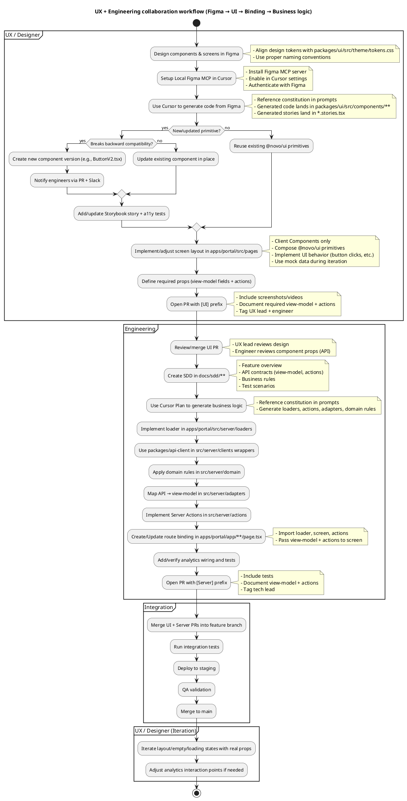

# Agent Portal — Constitution

Constitution Version: 0.2.0

This document defines the non-negotiable engineering standards for the **Agent Portal** web application.

## Core principles

- **Ship safely, repeatedly**: small PRs, feature flags, and predictable releases.

- **Type safety is a feature**: default to TypeScript, keep types close to data boundaries.

- **A11y and performance are baseline**: not "nice-to-have" follow-ups.

- **Consistency beats cleverness**: prefer boring, proven patterns; avoid bespoke frameworks.

- **Single source of truth**: prefer "derive" over "duplicate" (state, permissions, config).

## Product goals (non-negotiable)

These goals drive architecture decisions. If an implementation conflicts with these, the implementation must change.

- **High-frequency UX/UI changes with minimal engineering involvement**:
  - UI layout and composition must be separable from business logic via a clear **view-model boundary**.

  - Prefer a **layered architecture** (route-level pages/screens + server loaders/adapters) over generic schema renderers.

- **Experimentation without deployments**:
  - Designers/PMs must be able to create, launch, and manage copy/content/layout experiments without code changes or redeploys.

- **First-class controlled experiments**:
  - A/B and multivariate support must include audience targeting, variant configuration, analytics, and lifecycle management.

- **Fully instrumented agent experience**:
  - Event-level tracking must cover page views, key actions, funnel steps, and error events, suitable for Amplitude.

- **Standardized event schemas**:
  - Consistent naming conventions across UI/components to enable reliable dashboards.

- **Near real-time data**:
  - Experiment + behavioral data must be available in near real time to support rapid iteration.

- **Sub-second response times**:
  - Optimize performance/latency; move long-running work to non-blocking async flows and never block UI on slow dependencies.

## Experimentation & dynamic UX (non-negotiable)

- **No mandatory schema renderer**:
  - This codebase does **not** require a JSON → UI renderer (avoid a "schema-engine" unless explicitly approved and justified).

  - Keep dynamic UX changes achievable via **composition + configuration**, not a generic renderer.

- **Experiment configuration**:
  - Variants, targeting, and rollout rules must be driven by a remote config/experiment service (AWS Parameter Store by default).

  - Experiment assignment must be deterministic per user/session and auditable.

- **Variant implementation pattern**:
  - Implement variants as normal React components and choose between them in Server Components / route loaders based on config.

  - Do not embed business logic into UI primitives; variant selection is orchestration logic.

- **Lifecycle management**:
  - Experiments must support start/stop, ramp, holdout, and cleanup (remove dead variants).

  - Every experiment must declare:
    - owner (PM/designer + engineering contact)

    - hypothesis

    - primary metric(s)

    - planned runtime and stop conditions

- **Analytics integration**:
  - Experiment exposure and variant IDs must be emitted as standardized events/properties via `packages/analytics`.

### Experiment Implementation Example

**Scenario**: A/B test two quote summary layouts

**Step 1: PM/Designer/Executive defines experiment**

- Experiment ID: `quote-summary-layout`

- Variants: `control`, `variant-b`

- Hypothesis: Variant B increases quote-to-bind rate by 10%

- Primary metric: Quote completion rate

- Owner: PM (Jane Doe) + Engineer (John Smith)

**Step 2: UX creates variant components** in `apps/portal/src/pages/quotes/**`:

```tsx
// QuoteSummaryControl.tsx
"use client";
import { Button } from "@novo/ui";

export type QuoteVm = { quoteId: string; statusLabel: string };
export type QuoteActions = { submitQuote: (input: { quoteId: string }) => Promise<{ ok: boolean }> };

export function QuoteSummaryControl(props: { vm: QuoteVm; actions: QuoteActions }) {
  // Original layout
  return <div>...</div>;
}
```

```tsx
// QuoteSummaryVariantB.tsx
"use client";
import { Button } from "@novo/ui";

export function QuoteSummaryVariantB(props: { vm: QuoteVm; actions: QuoteActions }) {
  // New layout with improved visual hierarchy
  return <div>...</div>;
}
```

**Step 3: Engineering wires up variant selection** in `apps/portal/app/quotes/[id]/page.tsx`:

```tsx
import { getExperimentVariant } from "@/server/experiments";
import { QuoteSummaryControl } from "@/pages/quotes/QuoteSummaryControl";
import { QuoteSummaryVariantB } from "@/pages/quotes/QuoteSummaryVariantB";
import { getQuoteVm } from "@/server/loaders/quote-page.server";
import { submitQuoteAction } from "@/server/actions/submit-quote.server";

export default async function Page(props: { params: Promise<{ id: string }> }) {
  const { id } = await props.params;
  const vm = await getQuoteVm({ id });

  // Get experiment variant from Parameter Store
  const variant = await getExperimentVariant("quote-summary-layout", userId);

  const ScreenComponent = variant === "variant-b" ? QuoteSummaryVariantB : QuoteSummaryControl;

  return <ScreenComponent vm={vm} actions={{ submitQuote: submitQuoteAction }} />;
}
```

**Step 4: Engineering adds analytics tracking** in `apps/portal/src/server/experiments/index.ts`:

```tsx
import { track } from "@novo/analytics";

export async function getExperimentVariant(experimentId: string, userId: string): Promise<string> {
  const variant = await fetchFromParameterStore(experimentId, userId);

  // Track experiment exposure
  track("portal.experiment.exposed", {
    experimentId,
    variant,
    userId,
  });

  return variant;
}
```

## Analytics & event schema (non-negotiable)

- **Full instrumentation**:
  - All key flows must emit page view, action, funnel, and error events.

  - Error events must include safe diagnostic context (no PII).

- **Standard event naming**:
  - Event names and properties must follow a single convention (e.g., `portal.<area>.<action>`), enforced centrally in `packages/analytics`.

  - UI components must not invent ad-hoc event names; use shared helpers/wrappers.

- **Near real-time availability**:
  - Events must be emitted client-side where appropriate and flushed reliably.

  - Any batching/retry behavior must preserve ordering semantics needed for funnel analysis.

## Performance & async (non-negotiable)

- **Latency SLO**:
  - User-perceived interactions must target sub-second response times for common actions.

- **Non-blocking design**:
  - Long-running work must be offloaded to async processing (background jobs/queues) and surfaced via polling, SSE/WebSockets, or optimistic UI where appropriate.

  - Server Actions/Route Handlers must have clear timeouts and avoid synchronous calls to slow dependencies on the request path.

## Governance & versioning (non-negotiable)

This constitution is a living contract. Changes must be intentional, reviewed, and trackable.

- **Constitution versioning**:
  - Maintain a version header in this file as `Constitution Version: X.Y.Z` near the top (add/update in any PR that changes rules).

  - Version policy:
    - **MAJOR**: breaking governance/process changes or rule removals/relaxations.

    - **MINOR**: new rules or strengthened requirements.

    - **PATCH**: clarifications, examples, typo fixes that do not change intent.

- **Change process**:
  - Any constitution change must be in its own PR or clearly called out in the PR description.

  - PR must include a short "Amendment summary" and rationale (why the change is needed, trade-offs).

  - If a rule is temporarily violated, it must be documented with a time-bound follow-up.

- **Package versioning**:
  - Workspace packages under `packages/*` follow SemVer.

  - Public/consumed packages (`ui`, `analytics`, `api-client`) must declare explicit exports and changes must include notes suitable for release logs.

## Technology choices (defaults)

- **Package manager**: Yarn (workspaces/monorepo). One lockfile. No npm/pnpm lockfiles.

- **Monorepo layout**: `/apps/*` + `/packages/*`.

- **Language**: TypeScript.

- **Host app**: Next.js (App Router) with React Server Components (RSC) in `apps/portal`.

- **UI library**: React + Tailwind + Vite in `packages/ui`.

- **UI primitives approach**: Use **shadcn/ui** components (Radix UI primitives + Tailwind composition) as the baseline for interactive primitives (Button, Dialog, Tabs, Dropdown, etc.).
  - `shadcn/ui` is typically **vendored source code** (generated/copied into the repo), not a runtime dependency—prefer this model.

  - Any adoption of new shadcn components must keep `packages/ui` as "primitives only" (no business rules, no API calls).

- **Routing**: Next.js App Router (`apps/portal/app/*`).

- **Data fetching & caching**: Next.js `fetch` caching + revalidation by default; TanStack Query only for truly client-owned client-side caching needs.

- **Forms/mutations**: Server Actions first; React Hook Form + Zod inside Client Components for complex UX.

- **Testing**: Vitest + React Testing Library for units/components; Playwright for e2e.

- **Lint/format**: ESLint + Prettier.

- **Containerization**: Docker for `apps/portal` deploys.

If the codebase uses a different stack, update this constitution in the same PR that introduces the change.

## Repository structure

Organize by **clear layers and ownership boundaries**. Features/domains can exist, but the primary rule is: **UI rendering is separate from server/business logic**.

Recommended baseline:

```
/apps
  ├── /portal                    # Next.js App Router host
      ├── app/                    # Routes: layout.tsx, page.tsx, loading.tsx, error.tsx
      ├── src/
          ├── app/                  # app shell: providers, auth, env, navigation helpers
          ├── pages/                # route-level layouts/screens (composition of UI primitives)
          ├── server/               # API clients + domain rules + adapters (engineer-owned)
          ├── shared/               # thin shared helpers (avoid duplicating packages/*)
      ├── public/
      ├── tests/
/packages
  ├── /ui                    # Design System / UI Library (Client Components)
  ├── /analytics                    # standardized SDK wrappers (Amplitude, GTM, OpenReplay)
  ├── /api-client                   # GraphQL/REST generated types + client adapters
/docs
  ├── /sdd                          # Software Design Documents (Spec-Driven Development)
```

Rules:

- **No deep relative imports** across packages/apps. Use workspace aliases and package entrypoints.

- Each feature/package exports a small public surface from `index.ts` / package exports.

- Keep build/tooling config at repo root; keep runtime config under `apps/portal/src/app`.

- Enforce server/client separation:
  - `*.server.ts` (or `server/` folders): server-only code.

  - `*.client.tsx` (optional) for client-only entrypoints and hooks.

  - If code can't be safely imported by both environments, it must be explicitly marked server-only or client-only.

### Collaboration model (page ↔ server boundary) (non-negotiable)

This repo is organized for two workflows to move in parallel:

- **UX/designers own "how it looks and behaves"** (layout, composition, interaction UX, accessibility, Storybook).

- **Engineers own "what it does"** (data access, authorization, domain rules, API calls, caching policy, side effects).

The collaboration contract is: **screens render view-models; server builds view-models**.

#### Ownership by folder (what to change)

- **UX / Design (primary)**:
  - `packages/ui/**`: design system primitives + Storybook (shadcn/ui components).

  - `apps/portal/src/pages/**`: route-level screens/layout components that compose `@novo/ui`.
    - **Important**: Designers create **Client Components only** in `src/pages/**`.

    - Designers implement UI behavior (e.g., `await actions.submitQuote({ quoteId })`), but do NOT fetch data or implement business logic.

    - Designers do NOT touch Server Components in `apps/portal/app/**`.

- **Engineering (primary)**:
  - `apps/portal/app/**`: route binding (`page.tsx`, `layout.tsx`, `loading.tsx`, route handlers) — **Server Components only**.

  - `apps/portal/src/server/**`: API wrappers, domain rules, adapters, loaders, Server Actions.

  - `packages/api-client/**`: generated contracts/types + low-level service clients.

  - `packages/analytics/**`: analytics SDK wrappers + safety guards.

#### What MUST NOT happen (guardrails)

- `packages/ui/**` must not:
  - fetch data, call backend APIs, or contain domain rules

  - import from `apps/portal/src/server/**`

- `apps/portal/src/pages/**` must not:
  - call backend APIs directly or implement domain rules/policy

  - import from `apps/portal/src/server/**` (pages/screens are render-focused; route binding happens in `app/**`)

  - be Server Components (designers only create Client Components)

- `apps/portal/app/**` is the binding layer:
  - it may import from `src/server/**` and from `src/pages/**`

  - it is **engineer-owned** (designers do not modify route binding)

#### Handoff contract (how UX and Engineering integrate)

- **Data contract**: engineers provide a serializable view-model (types owned by engineering).

- **Action contract**: engineers provide Server Actions (or URLs) as props.

- **UI contract**: designers implement screens that depend only on view-model + action props and may call analytics for UI interactions.

#### Concrete binding example (end-to-end)

This example shows exactly how **UX output** (a screen component) binds to **engineering output** (loader + Server Action) without designers touching route binding or server code.

**UX creates** the screen in `apps/portal/src/pages/**` (render-focused, no server imports):

```tsx
// apps/portal/src/pages/quotes/QuoteScreen.tsx
"use client";

import { Button } from "@novo/ui";
import { track } from "@novo/analytics";

export type QuoteVm = {
  quoteId: string;
  statusLabel: string;
};

export type QuoteActions = {
  submitQuote: (input: { quoteId: string }) => Promise<{ ok: boolean }>;
};

export function QuoteScreen(props: { vm: QuoteVm; actions: QuoteActions }) {
  const { vm, actions } = props;

  return (
    <div>
      <h1>Quote {vm.quoteId}</h1>
      <p>Status: {vm.statusLabel}</p>

      <Button
        onClick={async () => {
          track("portal.quotes.submit_clicked", { quoteId: vm.quoteId });
          const result = await actions.submitQuote({ quoteId: vm.quoteId });
          track("portal.quotes.submit_finished", { quoteId: vm.quoteId, ok: result.ok });
        }}
      >
        Submit
      </Button>
    </div>
  );
}
```

**Engineering creates** the loader and Server Action in `apps/portal/src/server/**`:

```ts
// apps/portal/src/server/loaders/quote-page.server.ts
import type { QuoteVm } from "@/pages/quotes/QuoteScreen";

export async function getQuoteVm(input: { quoteId: string }): Promise<QuoteVm> {
  // 1) call src/server/clients/* (wrapping packages/api-client)
  // 2) apply src/server/domain/* rules
  // 3) adapt in src/server/adapters/* (API -> view model)
  return { quoteId: input.quoteId, statusLabel: "Draft" };
}
```

```ts
// apps/portal/src/server/actions/submit-quote.server.ts
"use server";

export async function submitQuoteAction(input: { quoteId: string }): Promise<{ ok: boolean }> {
  // 1) validate/authorize
  // 2) call src/server/clients/*
  // 3) map errors to portal-safe errors
  return { ok: true };
}
```

**Engineering binds** them together in the route file `apps/portal/app/**/page.tsx`:

```tsx
// apps/portal/app/quotes/[quoteId]/page.tsx
import { QuoteScreen } from "@/pages/quotes/QuoteScreen";
import { submitQuoteAction } from "@/server/actions/submit-quote.server";
import { getQuoteVm } from "@/server/loaders/quote-page.server";

export default async function Page(props: { params: Promise<{ quoteId: string }> }) {
  const { quoteId } = await props.params;

  const vm = await getQuoteVm({ quoteId });

  return <QuoteScreen vm={vm} actions={{ submitQuote: submitQuoteAction }} />;
}
```

**Key rule**: designers own `QuoteScreen` (layout + UI interactions). Engineers own `getQuoteVm`, `submitQuoteAction`, and the route binding `page.tsx`.

#### Quick start for UX / Designers

##### Figma → Code Generation Workflow

**Design in Figma**:

- Create/update components with proper naming conventions

- Ensure design tokens align with `packages/ui/src/theme/tokens.css`

**Setup Local Figma MCP**:

- Install and configure local Figma MCP server

- Enable Figma MCP in Cursor settings

- Authenticate with Figma account

**Generate UI Components with Cursor**:

- Use Cursor to generate components from Figma designs

- Generated code **always lands in `packages/ui/src/components/**`**

- Generated Storybook stories land in `packages/ui/src/components/**/*.stories.tsx`

- Reference this constitution in Cursor prompts to ensure compliance

**Component Versioning & Backward Compatibility**:

- **Existing components must maintain backward compatibility**

- If a change would break existing usage:
  - Create a new component version (e.g., `ButtonV2.tsx`)

  - Notify engineers via PR description and Slack

  - Engineers will migrate usage and deprecate old version

- If change is backward compatible:
  - Update existing component in place

  - Update Storybook stories to reflect changes

**Review & Refine Generated Code**:

- Ensure Tailwind class usage (no arbitrary values unless justified)

- Verify accessibility (ARIA labels, keyboard navigation, focus management)

- Confirm theme token usage (CSS variables, not hardcoded colors)

- Add/update `*.stories.tsx` for Storybook

- Add basic component tests for non-trivial behavior

**Build Screen Layouts in `apps/portal/src/pages/**`**:

- Compose `@novo/ui` primitives into screens (Client Components only)

- Use mock data or placeholder view-model types during design iteration

- Implement UI behavior (button clicks, form interactions) using action props

- Fire analytics for UI interactions at the screen/composition layer

**Open PR with `[UI]` prefix**:

- Include screenshots/videos of changes

- Document required view-model fields + action props (what data/callbacks you need)

- Tag UX lead + engineer for review

##### Designer Checklist

- \[ \] **Design in Figma**: build/update primitives and screens; keep tokens aligned with `packages/ui/src/theme/tokens.css`.

- \[ \] **Update primitives in `packages/ui/**`**:
  - Create/update component source and styles (shadcn/ui patterns).

  - Add/maintain `*.stories.tsx` so the component is reviewable in Storybook.

  - Add a basic component test when behavior is non-trivial (keyboard, disabled, dialog open/close).

- \[ \] **Build screens/layout in `apps/portal/src/pages/**`**:
  - Compose `@novo/ui` primitives into a screen (layout + UX).

  - Use mock data and/or a placeholder view-model type during design iteration.

  - Fire analytics for UI interactions at the **screen/composition** layer if needed.

- \[ \] **Do not touch**: `apps/portal/app/**`, `apps/portal/src/server/**`, `packages/api-client/**` (engineer-owned binding/business logic).

- \[ \] **Handoff**: document required view-model fields + actions as component props (what data you need, what callbacks you need).

#### Quick start for Engineers

##### Spec-Driven Development with Cursor Plan / Speckit

**Create Software Design Document (SDD)**:

- Document requirements in `docs/sdd/**` (or upload from external sources)

- Include:
  - Feature overview

  - API contracts (view-model types, action signatures)

  - Business rules and domain logic

  - Error handling requirements

  - Test scenarios

**Generate Business Logic with Cursor Plan**:

- Use Cursor Plan to generate loaders, actions, adapters, and domain rules

- **Reference this constitution in Cursor prompts** to ensure compliance

- Example prompt: "Generate a quote loader following the Agent Portal constitution. The loader should fetch quote data from the API client, apply eligibility rules, and return a QuoteVm view-model."

**Generated Code Locations**:

- Loaders: `apps/portal/src/server/loaders/**`

- Actions: `apps/portal/src/server/actions/**`

- Adapters: `apps/portal/src/server/adapters/**`

- Domain rules: `apps/portal/src/server/domain/**`

- Clients: `apps/portal/src/server/clients/**`

**Review Generated Code Checklist**:

- \[ \] No business logic in `packages/ui` or `src/pages`

- \[ \] View-model types match screen component props

- \[ \] Server Actions are marked `"use server"`

- \[ \] Loaders use `packages/api-client` via `src/server/clients/*` wrappers

- \[ \] Domain rules are in `src/server/domain/*`, not scattered

- \[ \] Error handling maps to portal-safe error messages

- \[ \] Tests added for loaders, actions, and adapters

**Bind Routes in `apps/portal/app/**`**:

- Create/update `page.tsx` (Server Component)

- Import loader from `src/server/loaders/**`

- Import screen from `src/pages/**`

- Import Server Actions from `src/server/actions/**`

- Pass view-model + actions as props to screen

**Implement Business Logic in `apps/portal/src/server/**`**:

- `loaders/**`: assemble view-models (fetch + domain rules + adapters)

- `actions/**`: mutations via Server Actions

- `clients/**`: portal-specific wrappers around `packages/api-client` (auth, caching, error mapping)

- `domain/**`: business rules, eligibility checks, calculations

- `adapters/**`: map API shapes → view-model shapes

**Use `packages/api-client/**`** for generated contracts/types:

- Do not duplicate types in `src/server`

- Wrap and compose generated clients in `src/server/clients/*`

**Use `packages/analytics/**`** for event tracking:

- Wrap vendor SDK (e.g., Amplitude)

- Enforce naming conventions and PII guards

- Keep business event mapping in portal app

**Open PR with `[Server]` prefix**:

- Include tests for loaders, actions, and adapters

- Document view-model types and action signatures

- Tag tech lead for review

##### Engineer Checklist

- \[ \] **Bind routes in `apps/portal/app/**`** (Server Components):
  - Load data via `apps/portal/src/server/loaders/**`.

  - Render the screen from `apps/portal/src/pages/**`.

  - Pass view-model + action props (Server Actions) into the screen.

- \[ \] **Implement business logic in `apps/portal/src/server/**`**:
  - `loaders/**`: assemble view-models (fetch + domain rules + adapters).

  - `actions/**`: mutations via Server Actions.

  - `clients/**`: portal-specific wrappers around `packages/api-client` (auth, caching, error mapping).

- \[ \] **Use `packages/api-client/**`** for generated contracts/types and low-level endpoint-shaped clients; do not duplicate types in `src/server`.

- \[ \] **Use `packages/analytics/**`** to wrap the vendor SDK (e.g., Amplitude) and enforce naming/PII guards; keep business event mapping in the portal app.

- \[ \] **Handoff back to UX**: once view-model and action props are stable, designers can iterate on layout safely in `src/pages/**`.

#### End-to-end workflow (PlantUML)



#### Package boundary: `src/server` vs `packages/api-client`

- `packages/api-client`: **shared contract layer** (generated types, low-level request helpers, serialization).

- `apps/portal/src/server`: **portal orchestration layer** (auth/session, caching policy, error mapping, domain rules, adapters, view-model loaders).

- Rule: do **not** duplicate generated types or raw endpoint definitions in `src/server`; wrap and compose them.

### Where should code live? (decision guide)

When in doubt, use the smallest-scope place that can own the responsibility long-term.

- **Put it in `packages/api-client` when** it is a **reusable, service-level contract**:
  - generated request/response types

  - low-level API client functions that directly map to endpoints (no portal-specific behavior)

  - serialization/deserialization helpers used by multiple apps

- **Put it in `apps/portal/src/server` when** it is **portal-specific orchestration**:
  - auth/session injection, headers, cookies

  - Next.js caching (`revalidate`, tags) and request policy (timeouts/retries)

  - domain rules/policy (eligibility, permissions, calculations)

  - mapping API shapes → portal view-models

  - page/screen loaders and Server Actions

- **Put it in `apps/portal/src/shared` when** it is a **small, cross-layer utility used by both pages and server** and is not already a package:
  - pure helpers (formatters, small type utilities, constants)

  - browser-safe and server-safe code only (no secrets, no network)

  - if it grows or is reused across apps, promote it to a `packages/*` package

Anti-patterns (do not do these):

- Duplicating endpoint types in `src/server` that already exist in `packages/api-client`

- Putting domain rules in `src/shared` "because multiple pages need it" (domain rules belong in `src/server/domain`)

- Putting portal auth/caching logic in `packages/api-client` (keeps the contract layer portable)

### `src/server` subfolders (recommended)

Use folders to scale without forcing "feature" boundaries:

- `src/server/api/`: low-level HTTP client wrappers, auth headers, retry, base URLs

- `src/server/clients/`: per-service clients (thin wrappers around `packages/api-client`, adding portal auth/session, caching, and error mapping)

- `src/server/domain/`: domain rules/policy (eligibility, permissions, calculations)

- `src/server/adapters/`: translate API shapes → view-model shapes

- `src/server/loaders/`: assemble data for a page/screen (the primary binding surface)

- `src/server/actions/`: Server Actions (mutations), composed from clients + domain rules

- `src/server/experiments/`: experiment configuration and variant selection logic

### Package responsibilities (strict)

- `apps/portal` (**Host**):
  - Owns routing (`app/`) and layout composition.

  - Coordinates RSC and Client Components.

  - Owns auth/session and server-side enforcement.

- `packages/ui` (**UI Project**):
  - **Pure Client Components** only (`"use client"` at the package boundary where required).

  - No business logic, no data fetching, no direct backend calls.

  - Tailwind-based styling lives here.

  - Built/tested with Vite.

- `packages/analytics` (**SDK wrappers**):
  - One standardized interface for analytics events.

  - Must be safe-by-default: no PII, explicit allowlists, and environment guards.

- `packages/api-client` (**Types & API adapters**):
  - Generated types live here (GraphQL/REST).

  - May expose server-safe and client-safe entrypoints separately if needed.

## Git/PR Workflow for Parallel Development

### Branch Strategy

- **UI branches**: `ui/<feature-name>` (designers)
  - Example: `ui/quote-summary-redesign`

  - Contains changes to `packages/ui/**` and `apps/portal/src/pages/**`

- **Server branches**: `server/<feature-name>` (engineers)
  - Example: `server/quote-summary-loader`

  - Contains changes to `apps/portal/src/server/**` and `apps/portal/app/**`

- **Integration branches**: `feature/<feature-name>` (merge UI + server)
  - Example: `feature/quote-summary`

  - Merge `ui/<feature-name>` and `server/<feature-name>` here

  - Run integration tests before merging to `main`

### PR Review Rules

#### UI PRs (`packages/ui/**`, `apps/portal/src/pages/**`)

**Reviewers**: UX lead + 1 engineer

**Engineer review focus**:

- Component props (API contract)

- TypeScript types for view-model and actions

- Backward compatibility

- Performance (unnecessary re-renders, large bundle size)

**Must include**:

- \[ \] Screenshots/videos of changes

- \[ \] Storybook stories for new/updated components

- \[ \] Accessibility checklist:
  - \[ \] Keyboard navigation works

  - \[ \] Focus management is correct

  - \[ \] ARIA labels are present

  - \[ \] Color contrast meets WCAG AA

- \[ \] Documentation of required view-model fields + action props

- \[ \] Component tests for non-trivial behavior

**PR title format**: `[UI] <description>`

- Example: `[UI] Add QuoteSummary screen with variant support`

#### Server PRs (`apps/portal/src/server/**`, `apps/portal/app/**`)

**Reviewers**: Tech lead only

**Must include**:

- \[ \] Tests for loaders, actions, and adapters

- \[ \] View-model type definitions

- \[ \] Action signature documentation

- \[ \] Error handling and edge cases

- \[ \] SDD reference (link to `docs/sdd/**`)

**PR title format**: `[Server] <description>`

- Example: `[Server] Implement quote loader with eligibility rules`

#### Integration PRs (`feature/<feature-name>`)

**Reviewers**: Tech lead + UX lead

**Must include**:

- \[ \] Integration tests (e2e or route-level)

- \[ \] QA validation checklist

- \[ \] Deployment notes (feature flags, migrations, etc.)

**PR title format**: `[Feature] <description>`

- Example: `[Feature] Quote summary redesign with A/B test support`

### Avoiding Conflicts

- **Designers must NOT**:
  - Modify route binding (`apps/portal/app/**/page.tsx`)

  - Touch server code (`apps/portal/src/server/**`)

  - Create Server Components

- **Engineers must NOT**:
  - Modify UI primitives (`packages/ui/**`) without designer approval

  - Change screen layouts (`apps/portal/src/pages/**`) without designer coordination

- **If both need to touch `apps/portal/src/pages/**`**:
  - Coordinate via Slack/standup before starting work

  - Designer owns layout/styling, engineer owns view-model types

  - Use pair programming or async review to avoid conflicts

### Merge Order

1. **UI PR** → merge to `ui/<feature-name>` branch

2. **Server PR** → merge to `server/<feature-name>` branch

3. **Create integration branch** `feature/<feature-name>`

4. **Merge UI branch** into integration branch

5. **Merge Server branch** into integration branch

6. **Run integration tests** on integration branch

7. **Merge integration branch** to `main` after approval

## Coding standards

- **Components**: function components only. No class components.

- **Props**: prefer explicit prop types over `React.FC`.

- **Naming**:
  - Components: `PascalCase`

  - Hooks: `useThing`

  - Files: `kebab-case.ts(x)` except React components may match component name.

- **No "magic" globals**: all environment variables must be validated at startup (e.g., Zod).

- **Immutability**: do not mutate state; use functional updates.

- **Side effects**: isolate in hooks (`useEffect`) or query/mutation layers; avoid in render.

## Next.js App Router + RSC rules (non-negotiable)

- **Default to Server Components**:
  - If it doesn't need browser-only APIs, stateful hooks, or event handlers, it is a Server Component.

- **Use `"use client"` sparingly**:
  - Add `"use client"` only at the smallest leaf component that needs it.

  - Never mark a whole route tree client-only just for a button.

- **Server/Client boundaries**:
  - Server Components may import server-only modules.

  - Client Components must not import server-only modules (DB clients, secrets, Node-only libs).

  - Prefer passing serializable props from Server → Client.

- **Data access**:
  - Do not fetch in Client Components by default. Fetch on the server (RSC) and pass results down.

  - Use React Query only when you truly need client-side caching, background refresh, or client-only lifecycles.

- **Mutations**:
  - Prefer Next.js **Server Actions** for form submissions and mutations.

  - Use Route Handlers (`app/api/...`) when you need a stable HTTP API boundary (3rd parties, webhooks, non-browser clients).

- **Caching & revalidation must be explicit**:
  - Decide per request: `cache: 'no-store'` vs revalidation (`next: { revalidate }`) vs tags.

  - Any dynamic/authenticated data must not be accidentally cached across users.

## React + Tailwind + Vite rules (UI package)

- `packages/ui` must be treatable as a "dumb" design system:
  - **No** feature flags, role checks, pricing logic, quoting logic, or API calls.

  - Components accept data + callbacks; they do not own domain policy.

- `packages/ui` MUST have a dedicated component development harness:
  - Prefer Storybook as the canonical harness for shared components and theme validation.

  - Storybook scope MUST be `packages/ui` only (do not mix app-only pages into the UI library's Storybook).

- Tailwind usage must be consistent:
  - Centralize theme tokens (colors, spacing, radii, shadows).

  - Prefer semantic class composition utilities (e.g., `clsx`) over ad-hoc string concatenation.

- Vite builds must output clean ESM/CJS as needed and proper type declarations.

## State management rules

Prefer the simplest tool that works:

- **Server state** (data from backend):
  - Prefer RSC (server fetch) + Next caching/revalidation.

  - If React Query is used in the client, cache keys must be **stable** and defined in one place (per area/screen).

  - Never manually "sync" server data into global client state unless there's a clear reason.

- **UI state** (modals, tabs): local component state by default.

- **Cross-feature client state**: context (scoped) first; a store only if necessary.

- **No state duplication**: derive from URL params, server state, or form state when possible.

## API and data boundary

- All HTTP calls go through server-owned modules (prefer `src/server/api/*` and `src/server/clients/*`) and must be safe for the environment they run in (server vs browser).

- `packages/api-client` provides **generated types + low-level clients**; `src/server/clients/*` provides **portal-specific wrappers**:
  - auth/session injection

  - Next.js caching/revalidation policy

  - consistent retry/timeout behavior

  - error mapping to a portal-safe error model

- Adapters live in `src/server/adapters/*` and translate API shapes to UI/view-model shapes (avoid leaking API weirdness).

- All API payloads must have:
  - **Runtime validation** at the boundary (Zod).

  - **Typed adapters** that translate API shapes to UI shapes (avoid leaking API weirdness).

- Errors must map to user-safe messages; never render raw stack traces.

Additional rules:

- **Never expose secrets to the client**. If a value is needed in the browser, it must be explicitly public and follow Next conventions.

- **Prefer a "BFF" model**: the Next app is the backend-for-frontend; keep domain adapters server-side and pass only the needed view model to clients.

### Binding `src/pages` ↔ `src/server` (how business logic connects)

The rule is simple: **pages render view-models; server builds them**.

- **Server-side "loader" functions** (in `src/server/loaders/*.server.ts`) assemble a typed view-model:
  - fetch from `src/server/clients/*`

  - apply policy from `src/server/domain/*`

  - adapt/normalize in `src/server/adapters/*`

  - return a serializable view-model object

- **Route `app/**/page.tsx`** calls the loader (Server Component), then renders a screen from `src/pages/**`:
  - `page.tsx` imports `getXPageVm()` from `src/server/loaders/...`

  - `page.tsx` imports `XPage()` (render-only) from `src/pages/...`

  - `XPage` composes `@novo/ui` primitives and receives only the view-model + callbacks/URLs

- **Mutations**:
  - Prefer Server Actions in `src/server/actions/*.server.ts` that call clients + domain rules.

  - Pass Server Action references or URLs down to the page/screen as needed (keeping UI components render-focused).

## Docker (apps/portal) rules

- `apps/portal` must be buildable and runnable via Docker in CI/CD.

- Use a multi-stage build:
  - dependencies → build → runtime

  - runtime image runs as non-root where possible

- Do not bake secrets into images; all secrets come from runtime environment.

- Health checks must exist (route handler or platform-specific).

## Routing and navigation

- Route definitions live under `src/app` (App Router). Route handlers/pages should render screens from `src/pages/*` and fetch/assemble data from `src/server/*`.

- Prefer nested layouts and route groups.

- URL is part of state:
  - Pagination, filters, selected entity IDs belong in URL where practical.

- **Auth & authorization**:
  - Enforce on the server (layouts/pages, server actions, route handlers).

  - Client-side checks may improve UX, but never replace server enforcement.

## UI, styling, and design system

- Prefer composition over inheritance.

- **Design system location (non-negotiable)**:
  - All reusable UI components MUST live in `packages/ui`.

  - Apps (e.g., `apps/portal`) MUST NOT create new reusable UI primitives (buttons, inputs, typography, cards, etc.). Apps may compose `packages/ui` components into feature-level composites when necessary.

- **Component coverage (non-negotiable)**:
  - Any UI component created for the portal SHOULD be added to the shared set in `packages/ui` unless it is strictly feature-specific and not reusable.

  - If a feature-specific component is created, it MUST be justified (why it shouldn't be shared) and kept within the feature folder.

- Styling must be consistent across the app:
  - Choose one primary approach (e.g., CSS Modules or Tailwind) and stick to it.

  - No inline styles except dynamic values not representable in class names.

- **Tailwind vs shadcn/ui responsibilities (non-negotiable)**:
  - Use **Tailwind** for layout/spacing/structure around components (grid, flex, gap, padding, margins).

  - Use **shadcn/ui components** (Radix UI primitives + Tailwind) for interactive primitives (Tabs, Buttons, Cards, Inputs, Dialogs, Menus, etc.).

  - Avoid inline styles for layout/spacing; use Tailwind instead. Inline styles are acceptable only as a temporary escape hatch for prototype gaps and must be justified.

  - **Monorepo Tailwind scanning (non-negotiable)**: consuming apps MUST include `packages/ui/src/**/*.{ts,tsx}` in Tailwind `content` globs so shared UI classes are not purged.

- **Theme tokens (non-negotiable)**:
  - Theme tokens MUST be implemented as **CSS variables**.

  - Tailwind utilities SHOULD reference the CSS variables (directly or via Tailwind theme extension), so swapping themes does not require component changes.

  - Do not hardcode hex colors inside shared component implementations when a token exists.

- **Accessibility** requirements:
  - Keyboard navigable flows; visible focus; correct ARIA labels.

  - No clickable `<div>`; use semantic elements.

  - Modals must trap focus and be dismissible.

## Copy, messaging, and localization (non-negotiable)

- **No hardcoded user-facing strings in JS/TS/TSX/HTML**:
  - Any text shown to users (labels, buttons, validation errors, empty states, toast messages, aria-labels, etc.) must be referenced via message keys and extracted into message catalogs.

  - Exceptions: temporary developer-only debug text behind explicit dev flags, never shipped to production.

- **Single message system**:
  - Use one i18n/message framework across the repo (portal + packages) with a consistent API.

  - Message keys must be stable and namespaced (e.g., `portal.quotes.title`, `ui.modal.close`).

- **Message composition rules**:
  - Do not concatenate strings to form sentences; use parameterized messages.

  - Do not embed markup in translations unless the framework supports safe rich-text interpolation.

- **Ownership**:
  - `packages/ui` may define UI-library messages (e.g., generic labels) but must not define business copy.

  - Business copy belongs to the portal app (prefer `apps/portal/src/pages/**` and route-adjacent modules), or a dedicated `packages/messages` if created later.

## Error handling, logging, observability

- Define a consistent error model (e.g., `AppError`) and error boundaries.

- Log with a structured logger (no random `console.log` in committed code).

- Capture:
  - route transitions (optional)

  - API errors (sanitized)

  - key user actions (auditable where needed)

## Security & privacy

- Never commit secrets. Use `.env` files locally and environment configuration in deployment.

- Implement:
  - CSRF strategy (if cookies are used)

  - strict CSP where feasible

  - secure cookie settings if applicable

- Sanitize untrusted HTML; avoid `dangerouslySetInnerHTML`.

- Personally Identifiable Information (PII):
  - do not log it

  - minimize client storage

  - mask in UI where appropriate

## Performance requirements

- Keep most pages as Server Components to minimize client bundle.

- Route-level code splitting is required for non-trivial pages.

- Avoid re-render cascades:
  - keep props stable

  - memoize expensive calculations

  - avoid creating functions/objects in render hot paths when measurable

- Use virtualization for large tables/lists.

- Images:
  - use Next.js image optimization where applicable

  - use responsive images

  - prefer modern formats

## Caching & rendering behavior (Next-specific)

- Any page that depends on **user-specific** data must ensure it cannot be served from a shared cache.

- Use tag-based invalidation for mutations when it reduces complexity vs client refetching.

- Streaming is allowed; ensure loading states are intentional (`loading.tsx`) and don't flicker.

## Testing strategy (non-negotiable)

- **Unit tests**: pure functions, adapters, validators, and analytics event mapping.

- **Component tests**: user-facing behavior (not implementation details) for UI primitives and portal client components.

- **Integration tests**: required for key routes, server actions, route handlers, auth/permissions boundaries, and cross-package wiring (portal + api-client + analytics + ui).

- **E2E tests**: critical business flows and auth/permissions boundaries.

Rules:

- **Unit + integration tests are required for all new behavior** (unless explicitly justified as impossible).

- Every bug fix must include a regression test when feasible.

- Tests must be deterministic; no arbitrary sleeps in e2e.

- Mock at the network boundary (MSW for UI/integration tests where helpful).

- **No untested business logic** in `apps/portal` or shared packages:
  - `packages/api-client`: unit tests for adapters/serialization and generated client wrappers as applicable.

  - `packages/analytics`: unit tests for event names/properties allowlists and PII guards.

  - `packages/ui`: component tests for critical primitives (buttons/inputs/modals) and accessibility behaviors.

## Tooling and quality gates

Required scripts (names can vary, but capabilities must exist):

- `yarn lint`

- `yarn format` / `yarn format:check`

- `yarn test` (unit + integration)

- `yarn test:unit` (or equivalent)

- `yarn test:integration` (or equivalent)

- `yarn test:e2e`

- `yarn typecheck`

- `yarn build`

Monorepo expectations:

- Root commands must target all relevant workspaces (or provide workspace-scoped equivalents).

- `apps/portal` must have `build`, `start`, and `typecheck` scripts.

- `packages/ui` must have `build` (Vite), `typecheck`, and component tests.

CI must block merges on:

- typecheck failures

- lint failures

- unit test failures

- integration test failures

- build failures

## Git/PR standards

- PRs must include:
  - what changed + why

  - screenshots/videos for UI changes

  - rollout notes if needed (flags, migrations)

- Keep PRs small; prefer incremental refactors.

- No direct commits to protected branches.

## Common Pitfalls & Anti-Patterns

### ❌ What NOT to do

**Putting business logic in `packages/ui`**

- ❌ Bad: `<Button onClick={() => fetch('/api/quotes')}>`

- ✅ Good: `<Button onClick={props.onSubmit}>`

**Designers modifying `apps/portal/app/**`**

- ❌ Bad: Designer updates `app/quotes/[id]/page.tsx` to change layout

- ✅ Good: Designer updates `src/pages/quotes/QuoteScreen.tsx`, engineer binds in `page.tsx`

**Engineers changing UI without designer approval**

- ❌ Bad: Engineer updates `packages/ui/Button.tsx` to fix spacing

- ✅ Good: Engineer notifies designer, designer updates component

**Duplicating types from `packages/api-client` in `src/server`**

- ❌ Bad: Copy-paste API types into `src/server/loaders/quote.ts`

- ✅ Good: Import from `packages/api-client` and adapt in `src/server/adapters`

**Hardcoding user-facing strings**

- ❌ Bad: `<Button>Submit Quote</Button>`

- ✅ Good: `<Button>{t('portal.quotes.submit')}</Button>`

**Creating Server Components in `src/pages/**`**

- ❌ Bad: Designer creates async Server Component in `src/pages/quotes/QuoteScreen.tsx`

- ✅ Good: Designer creates Client Component, engineer creates Server Component in `app/quotes/[id]/page.tsx`

**Fetching data in Client Components**

- ❌ Bad: `useEffect(() => fetch('/api/quotes'), [])`

- ✅ Good: Fetch in Server Component, pass as props to Client Component

**Breaking backward compatibility without versioning**

- ❌ Bad: Change `Button` props without creating `ButtonV2`

- ✅ Good: Create `ButtonV2`, notify engineers, migrate usage

### Decision Trees

#### "Where should this code live?"

```
Is it a UI primitive (button, input, card)?
├─ Yes → packages/ui
└─ No
   ├─ Is it a screen layout/composition?
   │  └─ Yes → apps/portal/src/pages
   └─ No
      ├─ Is it business logic (domain rules, API calls)?
      │  └─ Yes → apps/portal/src/server
      └─ No
         ├─ Is it a generated API type/client?
         │  └─ Yes → packages/api-client
         └─ No
            ├─ Is it analytics tracking?
            │  └─ Yes → packages/analytics
            └─ No → apps/portal/src/shared (if truly shared utility)
```

#### "Who should review this PR?"

```
What changed?
├─ packages/ui or apps/portal/src/pages
│  └─ Reviewers: UX lead + 1 engineer (focus on component props)
├─ apps/portal/src/server or apps/portal/app
│  └─ Reviewers: Tech lead only
├─ Both UI and server
│  └─ Reviewers: UX lead + Tech lead (integration PR)
└─ packages/api-client or packages/analytics
   └─ Reviewers: Tech lead + 1 engineer
```

#### "Can I modify this file?"

```
File: packages/ui/**
├─ Designer: Yes (with backward compatibility check)
└─ Engineer: Only with designer approval

File: apps/portal/src/pages/**
├─ Designer: Yes (Client Components only)
└─ Engineer: Only for view-model types or with designer coordination

File: apps/portal/app/**
├─ Designer: No
└─ Engineer: Yes

File: apps/portal/src/server/**
├─ Designer: No
└─ Engineer: Yes

File: packages/api-client/**
├─ Designer: No
└─ Engineer: Yes (usually generated)
```

## "Breaking the rules"

Exceptions are allowed only when:

- you document the trade-off in the PR description, and

- you add a follow-up task, and

- you keep scope minimal.

If a rule becomes painful, propose an amendment to this constitution.

---

## Amendment Summary (v0.2.0)

**Changes from v0.1.3**:

- Added detailed Figma → Code generation workflow for designers

- Added Spec-Driven Development (SDD) workflow for engineers using Cursor Plan/Speckit

- Clarified that designers only create Client Components in `src/pages/**`, not Server Components

- Added Git/PR workflow with branch strategy (`ui/*`, `server/*`, `feature/*`)

- Added PR review rules (UX lead + engineer for UI, tech lead for server)

- Added experiment implementation example with Parameter Store

- Added PlantUML diagram updates to include Figma MCP and Cursor Plan steps

- Added "Common Pitfalls & Anti-Patterns" section

- Added decision trees for "Where should this code live?", "Who should review?", "Can I modify?"

- Added `/docs/sdd` folder to repo structure for Software Design Documents

- Added `src/server/experiments/` folder for experiment configuration

- Clarified component versioning and backward compatibility requirements

**Rationale**: These changes address the collaboration workflow between UX designers using Figma/Cursor and engineers using Cursor Plan/Speckit, ensuring clear ownership boundaries and reducing conflicts.